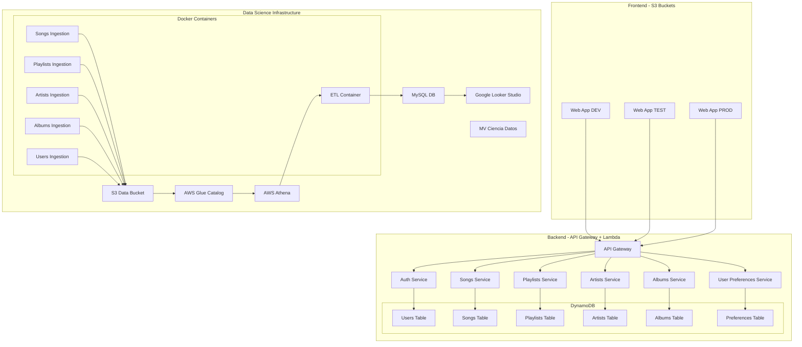
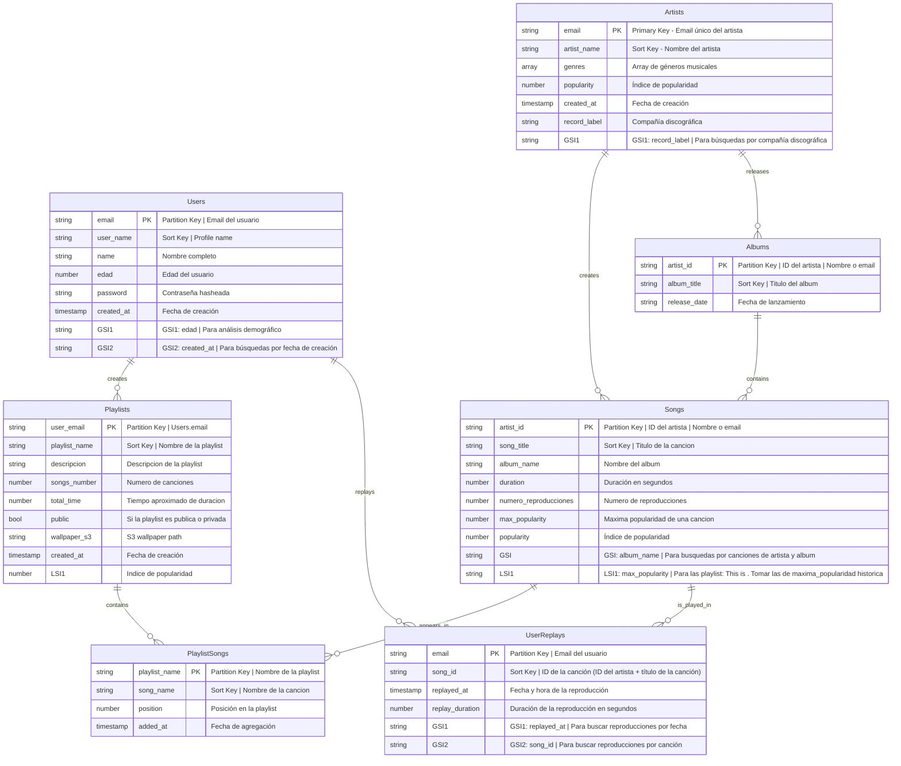

# PROYECTO FINAL CLOUD COMPUTING

- **Integrantes:** Máximo 5 personas por grupo
- **Funcionalidad:** Usted elegirá la funcionalidad  a implementar. Ejemplo: Sistema para un  Banco, para una compañía de Seguros, para  una cadena de cines, para una aerolínea, para una casa de apuestas en línea, para una tienda de Comercio Electrónico, para un videojuego en línea, para streaming de música como Spotify, etc. Considere que si hace un red social como Spotify, el `tenant_id` en la Tabla Usuarios es el email del usuario.

- **Arquitectura:**
    - Multi-tenancy

## RUBRICA
- BackEnd (7 puntos)
- FrontEnd (4 puntos)
- Data Science (6 puntos)
- Diagrama de Arquitectura Solución (1 punto)
- Exposición presencial (2 puntos)

### BACKEND

- **Bases de Datos:** Deberá usar DynamoDB en todas las Apis. Debe diseñar la clave de partición y clave de ordenamiento como Multi-tenancy y priorizando consultas por query y no por scan. Debe tener como mínimo 1 “Global secondary index (GSI)” y 1 “Local secondary index (LSI)”. Debe configurar en cada tabla DynamoDB la funcionalidad de “Copias de seguridad - Recuperación a un momento dado(PITR)”. Debe presentar un diagrama donde relacione lógicamente todas las tablas DynamoDB y se muestre la estructura json de cada tabla.
- **Seguridad:** Deberá tener un Api Usuarios Multi-tenancy que permita crear usuario, login usuario y validar token de acceso. Todas las demás Apis deben estar protegidas con token de acceso.
- **Microservicios:** Debe implementar como mínimo 6 Apis Multi-tenancy con Lambdas y Api Gateway incluyendo al Api Usuarios. Debe automatizar su despliegue con framework serverless en 3 stages (dev, test y prod) incluyendo las tablas DynamoDB. Debe implementar la mitad de lambdas en python y la otra mitad en node.js.
- **Datos de prueba:** Debe insertar masivamente, por única vez, datos ficticios (fake data) en todas las tablas DynamoDB (Mínimo 10,000 registros x tabla repartidos entre 3 tenant_id diferentes).
- **Documentación:** Debe documentar las 6 apis para visualizarlas en swagger-ui.
- **Código Fuente:** Debe incluir enlaces a repositorios públicos de github con las fuentes

## FRONTEND

- Debe implementar una página web Multi-tenancy con login de usuario y desplegarla en un bucket S3 de AWS (Simple Storage Service) y que invoque a los 6 microservicios (como mínimo a 1 método de cada api rest). Deben existir 3 buckets S3, uno por cada stage (dev, test, prod) y que invoquen a las apis respectivas.
- Puede usar el framework web del lado del cliente de su preferencia. Ejemplos:
    - Javascript puro
    - Javascript con framework: react.js, angular.js, vue.js
- Debe incluir enlace a repositorio público de github con las fuentes.

## DATA SCIENCE

- **Cómputo:** Debe crear una máquina virtual “MV Ciencia Datos” por cada stage (dev, test, prod) con tipo de instancia "t2.medium" (2 vCPU, 4 GB RAM).
- **Almacenamiento:** Debe crear un bucket S3 por cada stage (dev, test, prod) para almacenar la ingesta de datos.
- **Ingesta de datos:**  Debe implementar 5 contenedores docker en python para la ingesta de datos con estrategia pull del 100% de los registros de las tablas  DynamoDB. Cada contenedor ingestará la data de 1 microservicio y generará archivos csv o json normalizados que cargue en el bucket S3. Se recomienda usar la funcionalidad de scan de DynamoDB (*) tomando en cuenta que DynamoDB pagina los resultados de las operaciones de scan. Con la paginación, los resultados del scan se dividen en "páginas" de datos que tienen un tamaño de 1 MB (o menos).
- **Catálogo de Datos:** Debe implementar un catálogo de datos en AWS Glue por cada archivo con estructura diferente que cargue al bucket S3. Debe crear un diagrama Entidad / Relación que relacione todas las tablas del catálogo de datos.
- **Analítica de Datos:** Debe mostrar evidencia de como mínimo 6 consultas SQL Multi-tenancy que unan varias tablas con AWS Athena y crear como mínimo 3 vistas Multi-tenancy.
- **Transformación:** Debe implementar 1 contenedor docker ETL (Extract, Transform, Load) en python que ejecute queries SQL con Athena e inserte los resultados en tablas resúmenes de BD MySQL (Utilizar MySQL en contenedor en “MV Ciencia Datos”). Debe crear un diagrama Entidad / Relación que relacione **todas las tablas** resúmenes.
- **Logs:** Los 6 contenedores deberán dejar archivos de logs con el mismo formato en un mismo directorio de la máquina virtual “MV Ciencia Datos” que tengan como mínimo: fecha_hora (hasta milisegundo), tipo_log (INFO, WARNING, ERROR, CRITICAL), nombre_contenedor, mensaje. Deberá mostrar evidencia de ejecución de queries sobre los logs con `lnav` para mostrar por cada contenedor su hora de inicio y fin, cantidad de registros procesados y los pasos más importantes del proceso con la información más relevante.
- **Dashboard o Panel de Control:** Debe implementar un Dashboard (Informe) Multi-tenancy en *Google Looker Studio* que utilice como fuente de datos la BD MySQL y tenga 10 gráficos de 5 tipos diferentes y 2 filtros como mínimo. Revise estos enlaces para *Looker Studio*: [enlace1](https://drive.google.com/file/d/1bwhr8ajhawdeUxgyT0g5PpH8A-BG584W/view), [enlace2](https://drive.google.com/file/d/1bn9B6C2zx-OOBA2zDZeH29HEsMWUKn-N/view)
- **Código Fuente:** Debe incluir enlaces a repositorios públicos de github con las fuentes.

<!-- (*) Referencia:** https://docs.aws.amazon.com/amazondynamodb/latest/developerguide/Scan.html -->

## DIAGRAMA DE ARQUITECTURA DE SOLUCIÓN
Debe elaborar un Diagrama de Arquitectura de Solución que incluya y relacione todos los  componentes de:

- BackEnd
- FrontEnd
- Data Science

## Consideraciones

- BASE DE DATOS: https://www.kaggle.com/datasets/maharshipandya/-spotify-tracks-dataset/code
    - Usar minimo 1 GSI, LSI
    - Implementar la funcionalidad "Copia de seguridad - Recuperacion en un momento dado (PITR)"
    - DATOS DE PRUEBA: Minimo 10K registros x tabla repartidos entre 3 tenant_id distintos

- LAMBDA & DYNAMODB CREATION: https://github.com/jeremy-jmc/api-pelicula/blob/main/serverless.yml

- DOCUMENTACION: 
    - https://github.com/fastapi/fastapi/issues/2712
    - https://stackoverflow.com/questions/64377405/how-to-generate-swagger-documentation-for-aws-lambda-python-api

- SEGURIDAD: https://us-east-1.console.aws.amazon.com/lambda/home?region=us-east-1#/functions/LoginUsuario?tab=code
    -  Implementar un API de usuarios con token de acceso
    -  Todas las API deben ser protegidas con token de acceso
    - S10 Sesion 2: https://utec.zoom.us/rec/play/cXvDDeJ7Ykg14r_8mVsJZne6u6jNRLSmRMj23nqSvzp_8Uoeizl45xTVx-uxvFBztctxiycVHYLqA9H1.6fF6NRMYkz0BMfai

### 1. Funcionalidad Principal

App de Spotify.

### 2. APIs Propuestas (6 microservicios)

1. **API Usuarios** (Python)
   - Registro/Login de usuarios
   - Gestión de perfiles
   - Validación de tokens
   - Multi-tenant authentication

2. **API Canciones** (Python)
   - CRUD de canciones
   - Gestión de metadata
   - Enlaces de streaming
   - Búsqueda y filtrado

3. **API Playlists** (Python)
   - Creación/edición de playlists
   - Compartir playlists
   - Playlists colaborativas
   - Playlists automáticas

4. **API Artistas** (Node.js)
   - Perfiles de artistas
   - Discografías
   - Biografías
   - Estadísticas básicas

5. **API Álbumes** (Node.js)
   - Gestión de álbumes
   - Metadata de álbumes
   - Organización de tracks
   - Arte y descripciones

6. **API Estadísticas** (Node.js)
   - Métricas de reproducciones
   - Tendencias
   - Análisis de usuario
   - Reportes de uso

### 4. Análisis de Datos

Consultas SQL Multi-tenant propuestas:
1. Top canciones por reproducciones por tenant (usuario)
2. Comportamiento de usuarios por género musical
3. Análisis de playlists más populares
4. Patrones de escucha por hora/día
5. Retención de usuarios por tipo de contenido
6. Análisis de artistas emergentes

### 5. Dashboard en Looker Studio

Gráficos propuestos:
1. Mapa de calor de actividad por hora/día
2. Gráfico de barras de géneros más escuchados
3. Gráfico circular de distribución de usuarios por plan
4. Serie temporal de nuevos usuarios
5. Gráfico de embudo de conversión
6. Gráfico de dispersión de engagement vs retención
7. Treemap de categorías de música
8. Gráfico de área de crecimiento de biblioteca
9. Gráfico de barras apiladas de tipos de dispositivos
10. Gráfico de líneas de tendencias de escucha
11. Canciones más reproducidas
12. Artistas más populares
13. Distribución de géneros
14. Tendencias temporales de escucha
15. Análisis de playlists
16. Métricas de engagement de usuarios

